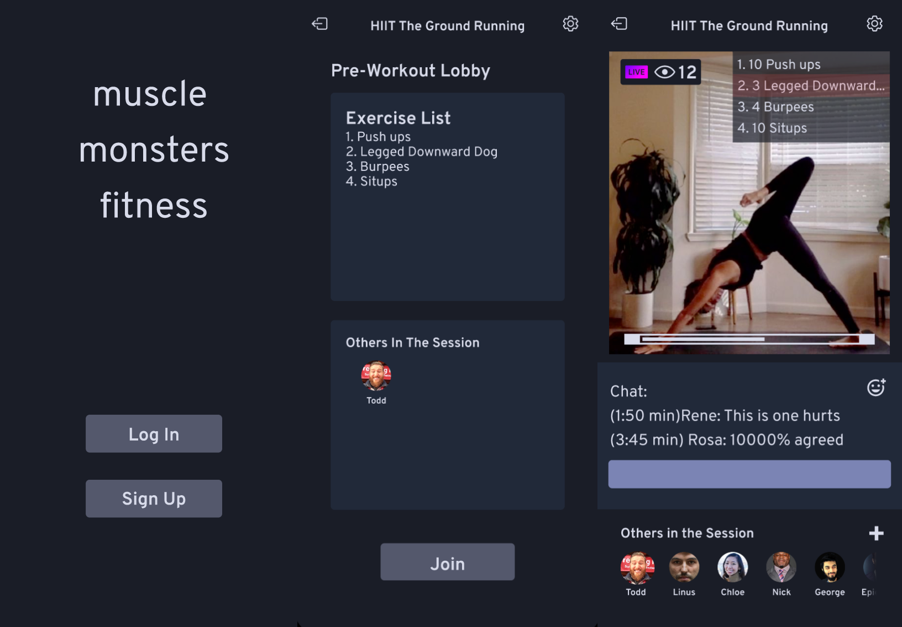

* I contributed to the design of an experience for a social platform that "gamifies" exercise in order to motivate people to get in shape. 
* My team and I conducted a 2x2 mixed factorial design, where we looked at:
1. looking at a design that focused on emulating social media apps vs a design that aimed to get them into a workout in one click 
2. Two types of participants, those who were interested in workoing out in groups vs those that worked out individually.

* The final walkthrough was desgined on Figma.
